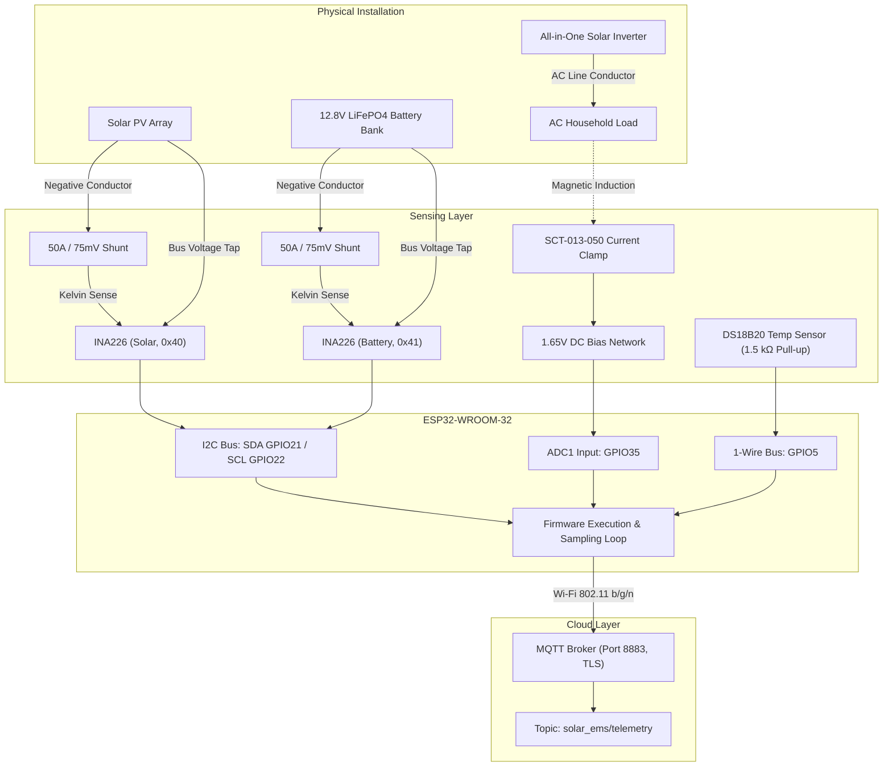

# Solar Energy Monitoring System

An ESP32-based IoT telemetry and sensing prototype designed for an off-grid solar installation. The system monitors DC power generation from a photovoltaic array, DC energy flow into and out of a 12.8 V LiFePO4 battery bank, AC household load consumption from an inverter, and panel surface temperature. Telemetry is serialized as structured JSON and transmitted to an MQTT broker over TLS every 5 minutes (300 seconds).

> **System Scope and Disclaimers:** This project is strictly an observational sensing, telemetry, and monitoring tool. It is **not** a Battery Management System (BMS), battery protection circuit, MPPT charge controller, inverter controller, autonomous energy-management system, or certified utility-grade energy meter. It does not perform active battery cell balancing, overcurrent cut-off, or autonomous load switching.

---

## What It Monitors

The device acquires physical measurements across four distinct operational domains:

- **Solar PV Array:** Bus voltage ($V$), array current ($A$), instantaneous power ($W$), and raw shunt voltage ($mV$).
- **Battery Storage (12.8 V LiFePO4):** Bus voltage ($V$), net battery current ($A$), net power ($W$), raw shunt voltage ($mV$), and a charging-state flag.
- **Inverter AC Load:** AC load current RMS ($A$) via non-invasive magnetic current clamp.
- **Environmental:** Solar panel rear surface temperature ($^\circ\text{C}$).
- **Metadata:** Unique device identifier (`solar_ems_001`), UTC ISO 8601 timestamp, and reading interval (300 s).

---

## System Architecture



### Ground Reference Topology
Both INA226 modules and the ESP32 share a common ground reference connected directly to the **battery negative post** on the **source side** of the low-side shunts. An inverter continuity test verified that the Inverter Battery Negative and Inverter PV Input Negative terminals are internally bonded (near 0 Ω), enabling a single shared DC ground. The AC current transformer (SCT-013) is magnetically isolated and references only the ESP32's local 3.3 V / GND bias circuit.

For an in-depth architectural breakdown, see [docs/architecture.md](docs/architecture.md).

---

## Hardware

The system is assembled from modular off-the-shelf components:

| Component | Specification | Function |
|---|---|---|
| **ESP32-WROOM-32** | 240 MHz dual-core, 520 KB SRAM, Wi-Fi | Central processor, sensor polling, TLS MQTT transmission |
| **INA226 (×2)** | 16-bit ADC, I2C interface | DC bus voltage, current, power, and shunt drop monitoring |
| **External Shunts (×2)** | 50 A / 75 mV ($R_{shunt} = 0.0015\ \Omega$) | Low-side current-to-voltage conversion (Battery and Solar) |
| **SCT-013-050** | 50 A / 1.0 V RMS, internal burden | Non-invasive AC load current measurement on inverter output |
| **DS18B20** | 1-Wire digital probe, ±0.5 °C accuracy | Solar panel surface temperature monitoring |
| **1-Wire Pull-Up** | 1.5 kΩ resistor | Bus pull-up for 1-Wire communication on final build |
| **Bias Network** | 2 × 10 kΩ resistors + 10 µF capacitor | 1.65 V DC midpoint bias network for unipolar ESP32 ADC |

### Final Microcontroller Pin Assignments

| ESP32 Pin | Function / Connected Subsystem | Notes |
|---|---|---|
| **GPIO21** | I2C SDA (Data) | Shared by Solar INA226 (`0x40`) and Battery INA226 (`0x41`) |
| **GPIO22** | I2C SCL (Clock) | Shared I2C clock line |
| **GPIO5** | 1-Wire DATA (DS18B20) | Connected with 1.5 kΩ pull-up to 3.3 V |
| **GPIO35** | ADC1 Input (SCT-013 Bias Circuit) | Input-only ADC1 pin; avoids Wi-Fi resource conflict on ADC2 |
| **3.3V / GND** | Logic Power & DC System Ground | Power rail and source-side common ground reference |

For full component specifications and wiring details, see [docs/hardware.md](docs/hardware.md).

---

## Firmware

The firmware is written in C++ for the Arduino framework ([firmware/solar_ems_sensor_firmware.ino](firmware/solar_ems_sensor_firmware.ino)).

### Required Libraries
- `INA226` by Rob Tillaart (v0.6.0+)
- `OneWire` by Paul Stoffregen (v2.3.8+)
- `DallasTemperature` by Miles Burton (v3.9.0+)
- `PubSubClient` by Nick O'Leary (v2.8.0+)
- `ArduinoJson` by Benoit Blanchon (v6.21.0+)

### Key Implementation Details
1. **Sampling Cadence:** Telemetry is gathered and published at 300-second (5-minute) intervals using non-blocking `millis()` polling.
2. **AC RMS Computation:** The firmware samples GPIO35 for 3000 readings at 100 µs intervals (~0.3 s window spanning multiple 50 Hz cycles). To prevent drift from temperature or resistor tolerances, the firmware calculates the dynamic mean of all samples, subtracts this mean as a self-correcting midpoint, squares the residuals, and converts RMS counts to RMS amperes.
3. **Time Synchronization:** At startup, UTC time is obtained via NTP (`pool.ntp.org`). To prevent boot stalls on firewalled networks where UDP port 123 is blocked, NTP acquisition is bounded to 20 attempts (10 seconds) before proceeding.
4. **Security and TLS Boundary:** The firmware communicates with the MQTT broker using a TLS-capable secure client (`WiFiClientSecure`). In the test firmware, server-certificate verification is disabled with `secureClient.setInsecure()`, so certificate validation should be configured before a production deployment.

---

## Telemetry

Readings are published to MQTT topic `solar_ems/telemetry` as a JSON document. The sample below is an actual historical prototype payload captured during the 25–26 August 2026 soak test. Note that `temperature_c` is `-127.0` because this historical record was generated under the earlier DS18B20 pull-up configuration prior to the final 1.5 kΩ hardware correction; it is not representative of DS18B20 behavior after the final 1.5 kΩ fix:

```json
{
  "device_id": "solar_ems_001",
  "timestamp": "2026-08-26T07:56:09Z",
  "solar": {
    "voltage_v": 22.36,
    "current_a": 5.322,
    "power_w": 119.05,
    "shunt_mv": 7.995
  },
  "battery": {
    "voltage_v": 13.40125,
    "current_a": -8.946,
    "power_w": 119.85,
    "shunt_mv": -12.3475,
    "charging": false
  },
  "load": {
    "current_a": 0.761626
  },
  "temperature_c": -127.0,
  "interval_s": 300
}
```

### Battery Charging Evaluation Rule
The firmware evaluates the `battery.charging` boolean flag strictly by the programmatic rule:
```cpp
bool charging = (batteryCurrent > 0.05);
```
The firmware marks `charging = true` when measured battery current exceeds `+0.05 A`. The 0.05 A threshold prevents zero-current ADC noise from toggling the state when the battery is idle.

For the complete payload specification and data dictionary, see [docs/mqtt-payload.md](docs/mqtt-payload.md).

---

## Testing

The system validation comprises three distinct phases:
1. **Bench Testing:** Verified with an artificial resistive/LED load. Sensor reporting integrity was confirmed by systematically checking Ohm's Law ($I = V_{shunt} / R_{shunt}$) against measured shunt voltage drops.
2. **Historical Extended Soak Testing:** Deployed on the live solar installation over approximately 25 hours (25–26 August 2026) under the earlier hardware configuration. Over 100 consecutive data points were captured via a Python MQTT subscriber:
   - **Solar PV Tracking:** Diurnal cycle observed, tracking from 22–24 V in daylight down to ~0.5 V overnight, returning to 20–25 V at dawn, with solar generation peaking between 49 W and 120 W.
   - **Battery Stability:** Maintained an expected operating range of 13.28 V to 13.52 V for a 12.8 V LiFePO4 bank.
   - **AC Load Current:** Plausible residential appliance loads between 0.30 A and 0.98 A RMS.
   - **DS18B20 Long-Wire Instability (Earlier Hardware):** During this soak test with an earlier 3.76 kΩ pull-up resistor, ~93% of temperature samples returned `-127.0 °C` due to line capacitance on the extended roof cable run. Valid readings (7%) tracked expected day/night thermal patterns (22 °C to 34.1 °C).
3. **Final DS18B20 Hardware Correction:** The pull-up was upgraded to 1.5 kΩ in the final physical build. Subsequent testing after installation confirmed that the previously observed DS18B20 communication failures and -127 °C readings were resolved. (In accordance with restrained engineering claims, quantitative post-change percentages or test durations are not asserted without surviving records).

For full testing data and analysis, see [docs/testing.md](docs/testing.md).

---

## Known Limitations

1. **INA226 Register Temporal Misalignment:** Bus voltage, current, and power registers are queried in separate I2C transactions. During rapid load swings, on-chip power calculations may reflect slightly different internal conversion instants than simultaneously reported voltage and current.
2. **DS18B20 Quantitative Data Bounds:** While subsequent testing confirmed that the 1.5 kΩ pull-up resolved the communication failures and -127 °C readings, exact quantitative post-change metrics (such as a formal multi-day soak log) were not preserved in the surviving project records.
3. **ESP32 ADC Non-Linearity:** The internal SAR ADC exhibits non-linear response near 0 V and 3.3 V. The SCT-013 conditioning circuit centers the AC waveform at ~1.65 V, operating within the most linear portion of the ADC curve, but absolute metering-grade accuracy is not claimed.
4. **Lack of Hardware Watchdog:** The firmware lacks an automated hardware watchdog timer (`esp_task_wdt`) to recover from indefinite I2C bus hangs or hard Wi-Fi stack lockups without a power cycle.
5. **TLS Certificate Insecurity:** The test firmware calls `secureClient.setInsecure()`. Production installations should supply the broker's root CA certificate.

---

## Repository Structure

```
solar-energy-monitoring-system/
├── README.md                           # Main engineering documentation
├── LICENSE                             # MIT License
├── CITATION.cff                        # Machine-readable academic citation metadata
├── .gitignore                          # Git exclusion rules
├── firmware/
│   └── solar_ems_sensor_firmware.ino   # Sanitized ESP32 Arduino firmware
├── docs/
│   ├── architecture.md                 # System topology, grounding, and data pipeline
│   ├── hardware.md                     # Bill of materials, schematics, and pin mappings
│   ├── mqtt-payload.md                 # MQTT schema, data dictionary, and sign conventions
│   ├── testing.md                      # Bench validation, soak test, and DS18B20 resolution
│   └── troubleshooting.md              # Historical issues, diagnoses, and resolutions
└── examples/
    └── sample_payload.json             # Historical prototype telemetry payload
```

---

## Getting Started

### 1. Prerequisites
- **Hardware:** ESP32-WROOM-32, 2 × INA226 modules, 2 × 50 A / 75 mV shunts, SCT-013-050 current clamp, DS18B20 probe, 1.5 kΩ resistor, 2 × 10 kΩ resistors, 10 µF capacitor.
- **Software:** Arduino IDE 2.x or PlatformIO, ESP32 Board Package (v2.0.0+).

### 2. Install Required Libraries
In Arduino IDE, open the Library Manager (**Ctrl+Shift+I**) and install:
- `INA226` by Rob Tillaart
- `OneWire` by Paul Stoffregen
- `DallasTemperature` by Miles Burton
- `PubSubClient` by Nick O'Leary
- `ArduinoJson` by Benoit Blanchon

### 3. Configure Firmware
Open [firmware/solar_ems_sensor_firmware.ino](firmware/solar_ems_sensor_firmware.ino) and update network and broker credentials:
```cpp
#define WIFI_SSID            "YOUR_WIFI_SSID"
#define WIFI_PASSWORD        "YOUR_WIFI_PASSWORD"
#define MQTT_BROKER          "YOUR_MQTT_BROKER"
#define MQTT_PORT            8883
#define MQTT_TOPIC           "solar_ems/telemetry"
#define MQTT_PUBLISHER_USER  "YOUR_MQTT_USERNAME"
#define MQTT_PUBLISHER_PASS  "YOUR_MQTT_PASSWORD"
```

### 4. Flash and Monitor
1. Connect the ESP32 via USB.
2. Select **Tools > Board > ESP32 Dev Module**.
3. Select the active COM port.
4. Compile and upload the sketch.
5. Open Serial Monitor at **115200 baud** to view startup diagnostics and 5-minute telemetry logs.

---

## Documentation

- [System Architecture](docs/architecture.md)
- [Hardware & Pin Mapping](docs/hardware.md)
- [MQTT Payload Specification](docs/mqtt-payload.md)
- [Testing & Soak Validation](docs/testing.md)
- [Troubleshooting History](docs/troubleshooting.md)

---

## License

This project is licensed under the [MIT License](LICENSE). Copyright © 2026 Adejire Adegite.
