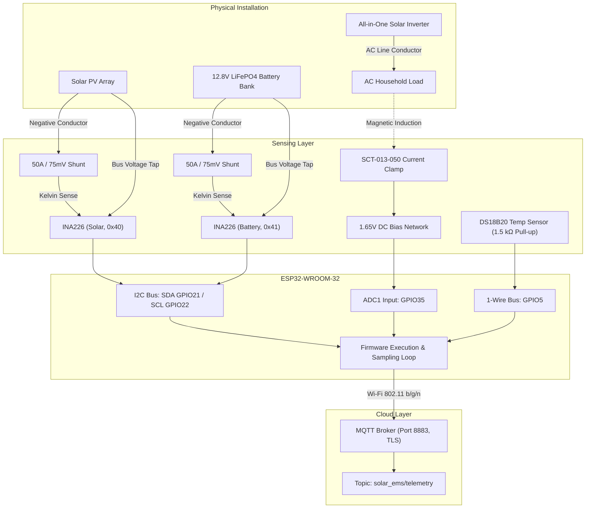

# System Architecture

This document describes the hardware and communication architecture of the ESP32-based solar energy monitoring system.

## System overview

The system is an IoT sensing and telemetry prototype designed for an off-grid solar installation. It acquires real-time physical measurements across four domains:
1. **Solar PV array:** Bus voltage, current, power, and shunt voltage.
2. **Battery storage:** Bus voltage, current, power, shunt voltage, and charging indicator.
3. **AC load:** Inverter output AC load current (RMS).
4. **Environment:** Solar panel surface temperature.

Readings are sampled every 5 minutes (300 seconds), serialized into structured JSON payloads, and transmitted to a cloud MQTT broker over a TLS connection.

> **System Scope Notice:** This system is strictly an observational sensing, telemetry, and monitoring tool. It is **not** a Battery Management System (BMS), battery protection circuit, MPPT charge controller, inverter controller, or certified utility-grade energy meter.

---

## Block diagram



---

## Ground reference configuration

The DC measurement topology uses low-side current sensing with external 50 A / 75 mV shunts located in the negative conductors of the battery and PV circuits:

1. **Shared DC Ground Reference:**
   - Both INA226 modules and the ESP32 microcontroller share a single common ground reference connected directly to the battery's negative post.
   - Ground leads are connected strictly to the **source side** of the shunts rather than the load/inverter side. Connecting ground downstream of a shunt would cause the shunt's current-dependent voltage drop to offset the system ground reference, corrupting all voltage readings.
   - An inverter continuity check confirmed that the inverter's Battery Negative terminal and PV Input Negative terminal are internally bonded (near-zero ohms with system powered off), validating the shared DC ground topology.
2. **AC Ground Isolation:**
   - The SCT-013 split-core current transformer provides galvanic isolation through magnetic induction.
   - The SCT-013 conditioning circuit references only the ESP32's local 3.3V and GND rails, with no direct electrical connection to the AC mains or the DC battery ground post.

---

## Communication and network pipeline

1. **Timing and Synchronization:**
   - On boot, the firmware synchronizes UTC time using NTP (`pool.ntp.org`, `time.nist.gov`, `time.google.com`).
   - If NTP times out after 20 attempts, the device proceeds to avoid permanent blocking on restricted networks.
   - Subsequent readings occur every 300 seconds (5 minutes) tracked via non-blocking `millis()` polling.
2. **Payload Serialization:**
   - Sensor readings are aggregated into a single JSON document using the `ArduinoJson` library (static buffer allocation of 512 bytes).
3. **MQTT Transport:**
   - Telemetry is transmitted over MQTT via `PubSubClient`.
   - The network transport uses `WiFiClientSecure` over TCP port 8883.

---

## Security and TLS claim boundary

The firmware communicates with the MQTT broker using a TLS-capable secure client. The test firmware disables server-certificate verification with `setInsecure()`, so certificate validation should be configured before a production deployment.

```cpp
secureClient.setInsecure();
```

This configuration bypasses X.509 server certificate verification, which was suitable for laboratory and prototype soak testing. For production deployments, certificate validation against the broker's root Certificate Authority (CA) should be enabled to protect against man-in-the-middle (MITM) attacks.

