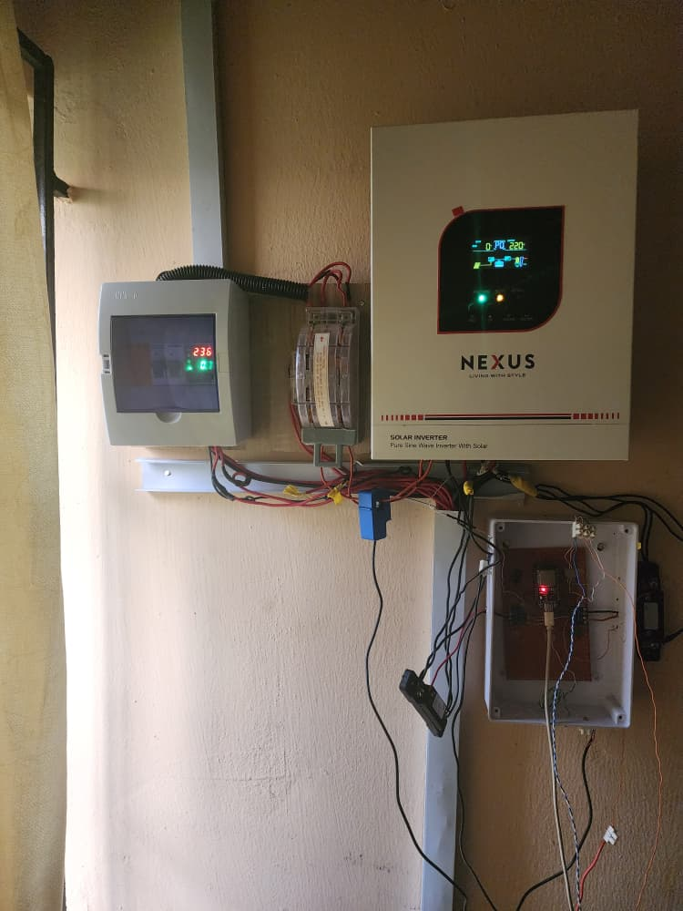
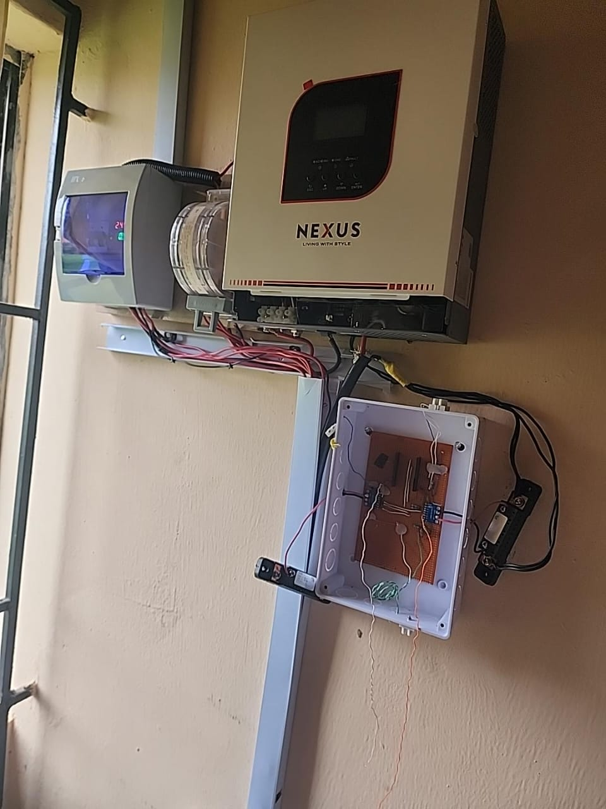
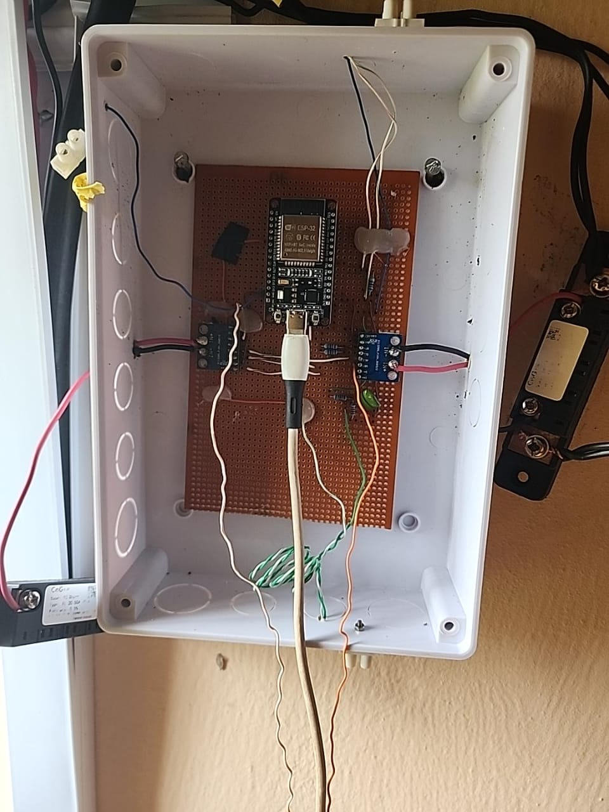
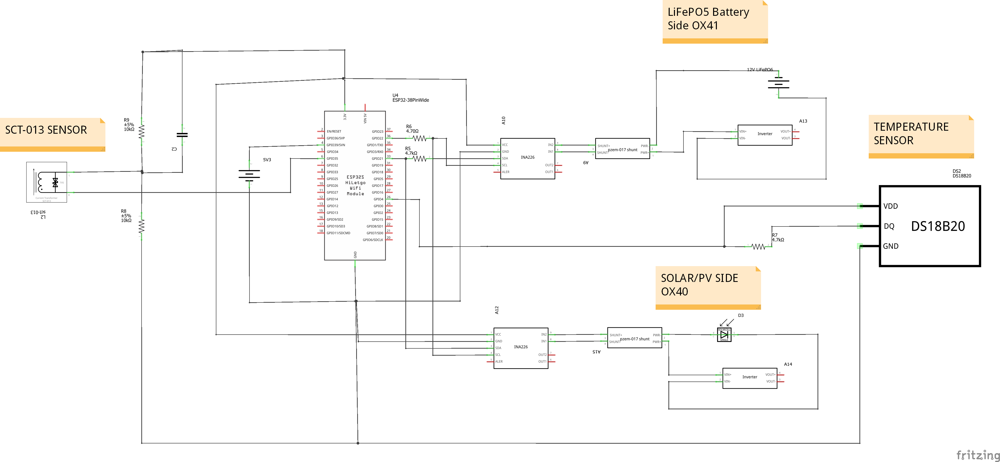
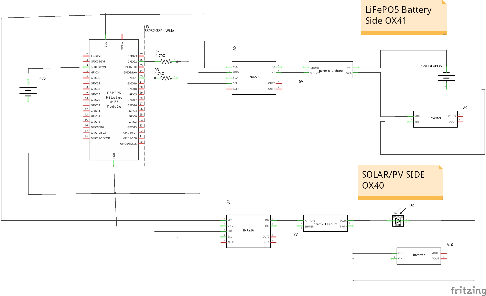
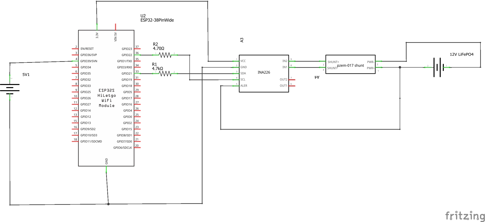
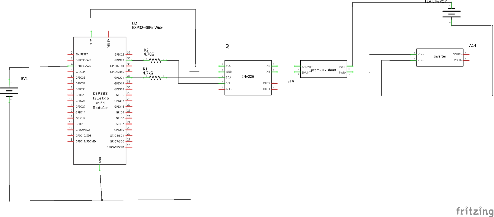
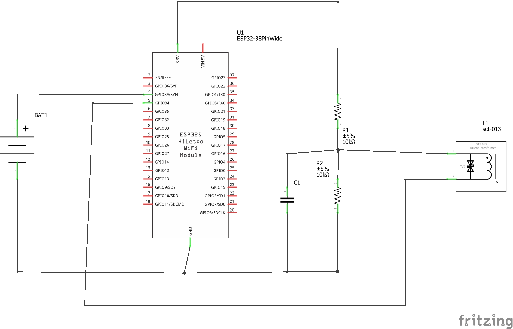
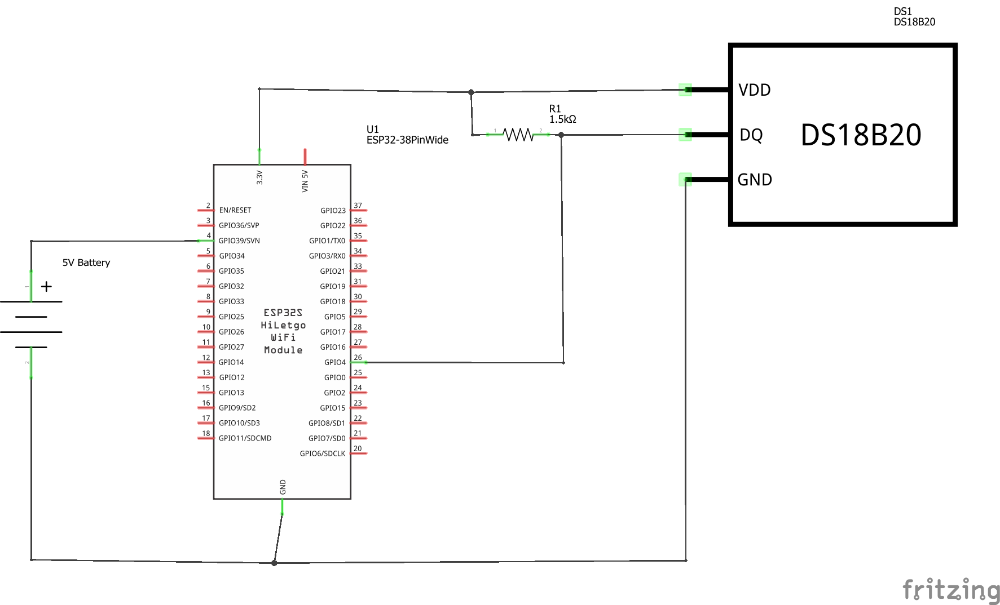

# Hardware Specifications and Implementation

This document details the physical implementation, hardware components, circuit schematics, electrical wiring topology, pin mapping, and conditioning circuits for the ESP32 solar energy monitoring prototype.

---

## 1. System Overview and Monitored Installation

The monitoring system is an observational data-acquisition unit deployed on an off-grid solar installation comprising:
- **Solar PV Array:** Parallel-configured photovoltaic panels operating up to ~25 V open-circuit.
- **Battery Storage:** 12.8 V nominal Lithium Iron Phosphate (LiFePO4) battery bank.
- **Inverter:** All-in-one solar inverter integrating charge controller and AC inverter functionality.
- **AC Load:** Standard 230 V / 50 Hz household electrical loads supplied by the inverter.

> **System Scope Notice:** The monitoring system is strictly an observational telemetry unit. It performs no charge management, switching, protective disconnection, or active inverter control, and must not be used as a Battery Management System (BMS) or certified billing meter.

---

## 2. Physical Implementation

The physical monitoring prototype was constructed using discrete prototyping techniques (perfboard assembly and off-the-shelf breakout modules) and integrated alongside the existing off-grid solar equipment.

### 2.1 Overall System Installation
The photograph below shows the full physical installation with the solar power equipment and the monitoring system mounted on the wall.

<p align="center">
  
  <br>
  <em>Physical installation overview: wall-mounted NEXUS pure sine wave solar inverter (active display showing 220 V), AC distribution breaker unit (~238 V), DC fuses, blue SCT-013 current clamp on AC output, and the white monitoring enclosure installed below.</em>
</p>

The all-in-one solar inverter handles DC charge management from the photovoltaic array and generates 230 V AC for domestic circuits. The monitoring unit is mounted directly below the inverter to keep DC sense wiring and AC transformer leads as short as practicable.

### 2.2 Monitoring Enclosure Context
The contextual view below shows the open monitoring enclosure mounted beneath the inverter and wiring conduit.

<p align="center">
  
  <br>
  <em>Contextual installation view: open monitoring enclosure positioned beneath the inverter wire duct, showing external shunt placement and cable routing.</em>
</p>

External FL-2 50 A / 75 mV current shunts are mounted directly on the wall surface adjacent to the enclosure, with low-voltage Kelvin sense leads entering the enclosure through dedicated knockouts.

### 2.3 Controller Board and Interface Assembly
The close-up photograph below shows the internal arrangement of the monitoring enclosure.

<p align="center">
  
  <br>
  <em>Monitoring enclosure interior: ESP32-WROOM-32 DevKit mounted on prototyping perfboard, powered via micro-USB, flanked by two blue INA226 breakout boards (Solar and Battery), with AC bias passives, 1-Wire pull-up, and external shunt Kelvin sense leads.</em>
</p>

Key visible elements include:
- **Microcontroller:** ESP32-WROOM-32 DevKit socketed onto the perfboard and powered through a 5 V DC micro-USB cable.
- **DC Measurement:** Two blue INA226 breakout modules mounted to the left and right of the ESP32, connected to the external battery and solar shunts via twisted-pair Kelvin sense leads.
- **SCT-013 Bias Network:** 10 kΩ voltage divider resistors and decoupling capacitor shifting the AC signal to the 1.65 V DC midpoint.
- **1-Wire Connection:** Screw terminals and bus pull-up resistor linking to the roof-mounted DS18B20 temperature probe.

---

## 3. Component Bill of Materials (BOM)

| Component | Part / Model | Specifications | Role in System |
|---|---|---|---|
| Microcontroller | ESP32-WROOM-32 | Dual-core Tensilica Xtensa 32-bit LX6 @ 240 MHz, 520 KB SRAM, 802.11 b/g/n Wi-Fi, 12-bit SAR ADCs | Master controller, sensor acquisition, NTP synchronization, JSON serialization, and TLS MQTT publishing |
| DC Power Monitors (×2) | INA226 Breakout Boards | I2C interface, 16-bit delta-sigma ADC, 0–36 V common-mode bus voltage, ±81.92 mV differential shunt range | On-chip bus voltage, shunt voltage, current, and power calculation for Battery and Solar PV circuits |
| Precision Shunts (×2) | FL-2 External DC Shunts | 50 A rated current, 75 mV drop at rated current ($R_{shunt} = 0.0015\ \Omega$), Kelvin sense terminals | Low-side current-to-voltage conversion on battery and solar negative rails |
| AC Current Sensor | SCT-013-050 | Non-invasive split-core current transformer, 50 A input, 1.0 V RMS output at rated current, internal burden resistor | Inverter AC output line current measurement |
| Temperature Sensor | DS18B20 | Waterproof probe, Maxim 1-Wire interface, 9–12 bit selectable resolution, -55 °C to +125 °C range (±0.5 °C accuracy from -10 °C to +85 °C) | Solar panel surface temperature measurement |
| 1-Wire Pull-Up Resistor | 1.5 kΩ Metal Film Resistor | 1.5 kΩ, 1/4 W (final physical build) | Bus pull-up for 1-Wire communication over extended cable run |
| AC Bias Conditioning | Voltage Divider + Decoupling | 2 × 10 kΩ resistors (1% tolerance) + 10 µF electrolytic capacitor | Shifts SCT-013 AC swing to a stable 1.65 V DC midpoint for ESP32 ADC |
| Power Supply | USB 5 V DC Adapter | 5 V DC, 1 A minimum | Supplies ESP32 via micro-USB port; onboard regulator outputs 3.3 V for sensors |

---

## 4. Microcontroller Pin Mapping

The pin assignments below reflect the **final firmware configuration**:

| ESP32 Pin | Connected Subsystem / Signal | Bus / Interface | Direction | Description |
|---|---|---|---|---|
| **GPIO21** | INA226 (Solar 0x40) SDA<br>INA226 (Battery 0x41) SDA | I2C Data | Bidirectional | Shared I2C data bus (`Wire.begin(21, 22)`) |
| **GPIO22** | INA226 (Solar 0x40) SCL<br>INA226 (Battery 0x41) SCL | I2C Clock | Output | Shared I2C clock bus |
| **GPIO5** | DS18B20 DATA | 1-Wire | Bidirectional | Dallas 1-Wire bus with 1.5 kΩ pull-up to 3.3 V |
| **GPIO35** | SCT-013 Signal Conditioning Output | ADC1 CH7 | Input (Analog) | 12-bit ADC reading (`analogReadResolution(12)`). Dedicated input-only pin on ADC1 |
| **3.3V** | INA226 VCC (both), DS18B20 VDD, Bias Divider High | Power | Output | Regulated 3.3 V logic and sensor supply rail |
| **GND** | Battery Negative Post (Common Ground), Sensor GNDs | Power / Reference | Ground | Shared DC system reference point on source side of shunts |

> **Development History Note:** Earlier drafts and schematics referenced GPIO4 for the DS18B20 and GPIO34 for the SCT-013. The final operational firmware standardizes on **GPIO5** for 1-Wire and **GPIO35** for the SCT-013. Both GPIO34 and GPIO35 belong to ADC1 and do not conflict with the Wi-Fi subsystem.

---

## 5. Circuit Schematics

The schematics below are the original design drawings created in Fritzing during hardware prototyping and system integration.

> **Development Schematic Caveat:** These drawings were produced during iterative laboratory development. Some schematics represent intermediate hardware revisions. Where an individual or integrated schematic differs from the final physical build or operational firmware, the firmware and documented as-built configuration take precedence.

### 5.1 Integrated Sensor Circuit
This schematic illustrates the complete hardware interconnection, combining the ESP32 microcontroller, dual INA226 DC measurement channels, the SCT-013 AC conditioning circuit, and the DS18B20 digital temperature probe.

<p align="center">
  
  <br>
  <em>Complete sensor circuit schematic from development (note: depicts earlier 4.7 kΩ pull-up on DS18B20; final physical build uses 1.5 kΩ).</em>
</p>

**Key Technical Details & Schematic Discrepancies:**
- **DS18B20 Pull-Up Resistor:** Resistor R7 is visibly labeled **`4.7kΩ`** in this drawing. In the final physical build, this was changed to **`1.5 kΩ`** to resolve 1-Wire communication timeouts over the extended roof cable run.
- **DS18B20 Data Pin:** Correctly connected to **`GPIO5`** (pin 29), matching the final operational firmware.
- **SCT-013 Pin Assignment:** Correctly connected to **`GPIO35`** (pin 6, ADC1_CH7) via the 10 kΩ / 10 kΩ voltage divider and capacitor C2, matching final firmware.
- **INA226 Addresses:** Battery INA226 is labeled `OX41` (`0x41`) and Solar INA226 is labeled `OX40` (`0x40`).
- **Shunt Representation:** External 50 A / 75 mV ($0.0015\ \Omega$) shunts are represented symbolically using the Fritzing "pzem-017 shunt" library part.
- **Typographical Notes:** The drawing contains minor Fritzing labeling quirks: "LiFePO5 Battery Side OX41" (referencing the 12.8 V LiFePO4 bank) and I2C pull-up R6 formatted as `4.70Ω` (intended 4.7 kΩ).

### 5.2 Solar and Battery INA226 Measurement
This drawing focuses on the dual DC current and bus voltage measurement architecture sharing the ESP32's hardware I2C bus.

<p align="center">
  
  <br>
  <em>Combined Solar and Battery INA226 measurement schematic on shared I2C bus (GPIO21 SDA / GPIO22 SCL).</em>
</p>

**Key Technical Details:**
- **Shared Bus:** Both INA226 modules share `GPIO21` (SDA) and `GPIO22` (SCL) with external 4.7 kΩ pull-up resistors (R3 and R4).
- **Addressing:** Distinct I2C addresses are established: `0x40` for Solar (A0 = GND, A1 = GND) and `0x41` for Battery (A0 = VS+, A1 = GND).
- **Low-Side Topology:** Both shunts are located in the negative conductors, sharing a common DC ground reference tied to the battery negative terminal.

### 5.3 Battery INA226 Interface
This schematic details the discrete connection between the battery-side INA226 module, the external 50 A / 75 mV shunt, and the 12.8 V LiFePO4 battery bank.

<p align="center">
  
  <br>
  <em>Battery INA226 interface schematic showing low-side current shunt and I2C connections to ESP32.</em>
</p>

**Key Technical Details:**
- **Kelvin Sense:** Differential inputs `IN+` and `IN-` connect across the shunt terminals.
- **Bus Voltage Tap:** In the physical installation, `VBUS` is tapped directly to the battery positive post (rather than the low-side shunt pad) to measure full battery terminal potential.

### 5.4 Solar INA226 Interface
This schematic details the discrete connection between the solar-side INA226 module, the PV array negative shunt, and the inverter PV input.

<p align="center">
  
  <br>
  <em>Solar INA226 interface schematic showing PV low-side shunt and I2C connection to ESP32.</em>
</p>

**Key Technical Details:**
- **Low-Side Shunt:** Placed in the PV array negative return rail.
- **Fritzing Artifacts:** The schematic includes a Fritzing battery part labeled "12V LiFePO7" connected to the inverter VIN+ terminal to represent DC potential during drawing development. In the physical installation, this is the PV array positive combiner conductor.

### 5.5 SCT-013 AC Current Interface
This schematic details the signal conditioning network for the SCT-013-050 non-invasive AC current transformer.

<p align="center">
  
  <br>
  <em>SCT-013 AC current sensor conditioning circuit with 1.65 V DC bias network.</em>
</p>

**Key Technical Details & Schematic Discrepancy:**
- **Bias Circuit:** Two 10 kΩ resistors (R1, R2) establish a 1.65 V midpoint virtual ground, stabilized by capacitor C1 (10 µF).
- **Pin Assignment Discrepancy:** This standalone drawing routes the sensor output to **`GPIO34`** (pin 5). During subsequent prototyping, the pin was changed to **`GPIO35`** (ADC1_CH7, pin 6) as reflected in the complete sensor schematic and operational firmware. Both GPIO34 and GPIO35 belong to ADC1 and avoid Wi-Fi radio conflicts on ADC2.

### 5.6 DS18B20 Temperature Interface
This schematic illustrates the Dallas 1-Wire temperature sensor interface with the updated bus pull-up resistance.

<p align="center">
  
  <br>
  <em>DS18B20 temperature sensor interface schematic showing the updated 1.5 kΩ pull-up resistor.</em>
</p>

**Key Technical Details & Schematic Discrepancy:**
- **Updated Pull-Up Resistor:** Pull-up resistor R1 is explicitly updated to **`1.5 kΩ`**, matching the final physical build that resolved long-wire line capacitance and communication timeouts.
- **Pin Assignment Discrepancy:** This standalone drawing depicts the 1-Wire data line connected to **`GPIO4`** (pin 26), reflecting the earlier prototype assignment. The final operational firmware standardizes on **`GPIO5`** (pin 29), as documented in the complete sensor circuit and pin mapping table.

---

## 6. DC Subsystem Wiring (INA226 and Low-Side Shunts)

### 6.1 Topology and Shunt Placement
Both DC measurement channels (Battery and Solar) utilize **low-side current sensing**:
- The shunt is placed in series with the **negative conductor** of the circuit.
- Battery Shunt: Located between the Battery negative post and the Inverter battery negative terminal.
- Solar Shunt: Located between the PV array negative combiner bus and the Inverter PV negative terminal.

### 6.2 INA226 I2C Addressing
The two INA226 modules share the I2C bus on GPIO21 (SDA) and GPIO22 (SCL):
- **Solar PV INA226:** Address **`0x40`** (A0 = GND, A1 = GND).
- **Battery INA226:** Address **`0x41`** (A0 = VS+, A1 = GND, bridged address jumper).

*(Note: Earlier project documentation listed Battery at 0x40 and Solar at 0x41; the final firmware explicitly establishes 0x40 for Solar and 0x41 for Battery).*

### 6.3 Sense Wire Wiring (Kelvin Connections)
Each shunt features two large main busbar terminals for the heavy power conductors and two small Kelvin sense screw terminals:
- Sense leads are run as twisted pairs directly from the Kelvin screws to the INA226 `IN+` and `IN-` header pins.
- Kelvin connections prevent current-dependent IR voltage drops across the high-current lugs from introducing measurement offsets.

### 6.4 Bus Voltage Reference (VBUS)
- The INA226 `VBUS` pin measures the total bus voltage relative to the module's `GND` pin.
- Because low-side sensing places the shunt near 0 V, connecting `VBUS` to the shunt's `IN+` terminal results in near-zero volt readings.
- **Correct Connection:** The `VBUS` terminal on the Solar INA226 must be wired directly to the PV positive rail. The `VBUS` terminal on the Battery INA226 must be wired directly to the Battery positive post.

### 6.5 Shunt Resistance and Calibration Parameters
The external shunts are rated 50 A / 75 mV:
$$R_{shunt} = \frac{0.075\ \text{V}}{50\ \text{A}} = 0.0015\ \Omega\ (1.5\ \text{m}\Omega)$$

In firmware, the Rob Tillaart INA226 library calculates internal calibration registers using:
```cpp
inaBattery.setMaxCurrentShunt(50.0, 0.0015);
inaSolar.setMaxCurrentShunt(50.0, 0.0015);
```

---

## 7. AC Load Current Sensing (SCT-013-050)

### 7.1 Operating Principle
The SCT-013-050 is a non-invasive current transformer with an internal burden resistor. When clamped around an AC conductor, it produces an AC voltage output proportional to current:
- Rated Current: 50 A RMS
- Rated Voltage Output: 1.0 V RMS (at 50 A RMS)
- Transformation Ratio: $50\ \text{A} / 1.0\ \text{V} = 50.0\ \text{A/V}$

### 7.2 Conditioning and Bias Network
The ESP32 analog-to-digital converter accepts unipolar voltages strictly between 0 V and 3.3 V. Because an AC signal alternates symmetrically about zero, feeding raw AC into the ADC would clip the negative half-cycles and damage the microcontroller.

A passive DC bias circuit shifts the AC signal:
```
           +3.3V
             |
            [R1: 10 kΩ]
             |
Midpoint ----+----[C1: 10 µF]----+ GND
 (1.65V)     |                   |
            [R2: 10 kΩ]          |
             |                   |
            GND                  |
             |                   |
       SCT Lead 1                |
                                 |
       SCT Lead 2 --------------+-----> ESP32 GPIO35 (ADC1_CH7)
```

1. **Midpoint Generation:** Equal-value 10 kΩ resistors $R_1$ and $R_2$ divide the 3.3 V rail to establish a virtual ground at:
   $$V_{mid} = 3.3\ \text{V} \times \frac{10\ \text{k}\Omega}{10\ \text{k}\Omega + 10\ \text{k}\Omega} = 1.65\ \text{V}$$
2. **AC Ground Stabilization:** The 10 µF electrolytic capacitor $C_1$ connects between the midpoint and ground, sinking AC currents and providing a low-impedance reference.
3. **Sensor Connection:** One lead of the SCT-013 connects to the 1.65 V virtual ground midpoint; the second lead connects directly to GPIO35.
4. **Dynamic Mean Subtraction in Firmware:** Rather than assuming an exact 1.65 V offset, the firmware computes the arithmetic mean of 3000 samples over each measurement burst and subtracts that mean, eliminating DC drift caused by resistor tolerance or temperature shifts.

### 7.3 Physical Clamp Placement
The split-core clamp is fastened around the **single live (Line) conductor** exiting the inverter's AC distribution terminal. Clamping both Line and Neutral cancel opposing magnetic fluxes, yielding a zero reading.

---

## 8. Temperature Sensing (DS18B20)

### 8.1 Interface and Form Factor
The DS18B20 is housed in a waterproof stainless steel capsule mounted directly to the rear surface of an outdoor solar panel. It communicates over Dallas 1-Wire on **GPIO5**.

### 8.2 Pull-Up Resistor Configuration
- The 1-Wire protocol relies on an open-drain bus architecture: devices pull the line low to transmit bits, while an external pull-up resistor pulls the line back to 3.3 V.
- **Earlier Prototype:** Used a standard pull-up resistor that measured ~3.76 kΩ in-circuit. Over the extended cable run from ground level up to the roof-mounted panel array, line capacitance slowed voltage rise times, leading to severe communication failure rates (~93% returned -127 °C).
- **Final Physical Build:** Uses a **1.5 kΩ pull-up resistor** connected between GPIO5 (DATA) and the 3.3 V rail. The lower resistance provides faster line rise times across parasitic cable capacitance. Subsequent testing after installation of the final 1.5 kΩ pull-up confirmed that the previously observed DS18B20 communication failures and -127 °C readings were resolved.

---

## 9. Common Grounding and Isolation Architecture

Proper grounding is essential in systems combining DC solar generation, high-current battery storage, and switched inverter AC:

1. **DC Grounding Point:**
   - The ESP32 ground pin and both INA226 ground pins are tied to a single common reference point at the **battery's negative post**.
   - All DC ground leads land on the **source side** of the shunts. If any sensor ground were connected downstream on the inverter side of a shunt, the current-dependent voltage drop across that shunt would lift the logic ground, producing erroneous voltage offsets across all sensors.
   - An ohmmeter continuity test on the inverter with power disconnected verified that the Inverter Battery Negative and Inverter PV Input Negative terminals share internal low-impedance bonding (near 0 Ω).
2. **AC Isolation:**
   - The SCT-013 current transformer provides inherent galvanic isolation through magnetic induction.
   - The AC bias conditioning circuit references the ESP32 3.3V and GND rails only, maintaining complete physical isolation from AC mains voltages.
